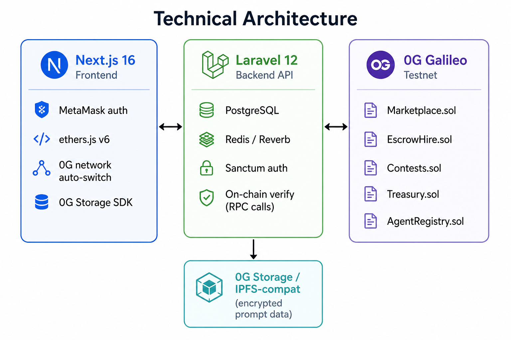
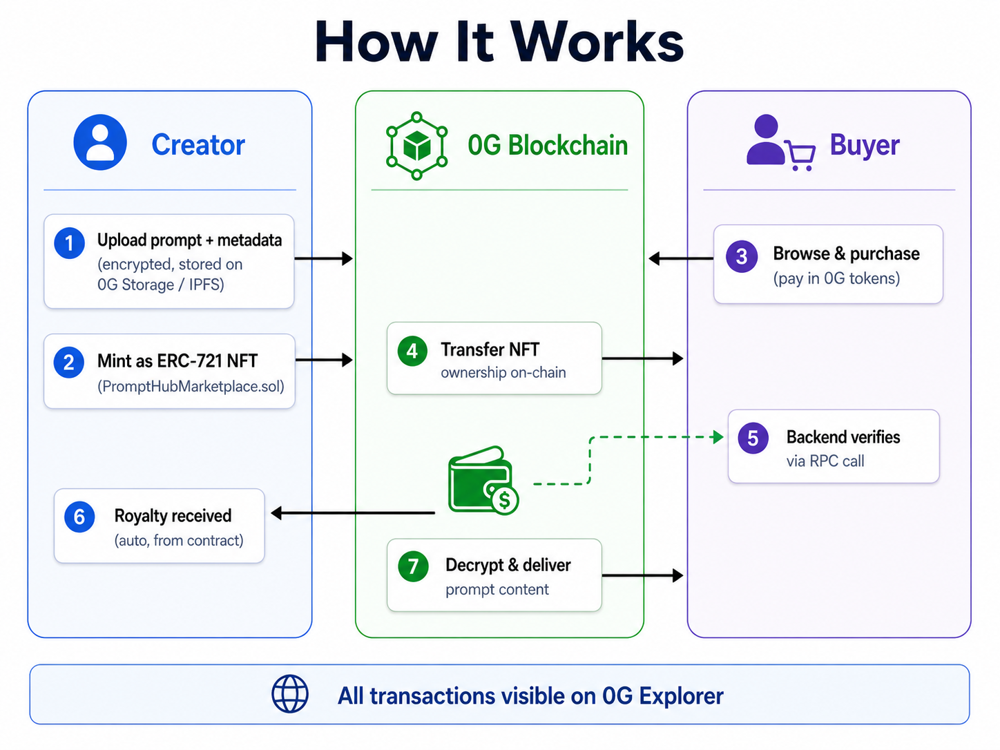

<p align="center">
  
</p>

<h1 align="center">PromptHub</h1>

<p align="center">
  <strong>The Onchain Economy for AI Prompt Creators</strong><br/>
  NFT ownership · Escrow freelancing · Brand contests . powered by 5 smart contracts on 0G Mainnet
</p>

<p align="center">
  <a href="https://prompthub.my.id">Live Demo</a> · <a href="https://prompthubdapps.biz.id">Backend API</a> · <a href="https://chainscan-galileo.0g.ai">0G Explorer</a>
</p>

---

## What is PromptHub?

PromptHub is a full-stack Web marketplace where AI creators mint, sell, and license prompts as **ERC-721 NFTs** on the **0G blockchain**. It combines Web2-grade UX (real-time messaging, creator dashboards, analytics) with trustless onchain logic (marketplace, escrow hire, contest payouts). Every transaction is verifiable on 0G Explorer. No middleman. No trust required.

---

## The Problem

The AI prompt market is worth **$500M+** and growing, yet it runs entirely on trust:

1. **No ownership proof** . Creators upload prompts to centralized platforms (PromptBase, ChatGPT Store) with zero onchain provenance. Copy paste piracy is rampant.
2. **No secure freelancing** . AI freelancers accept jobs on Fiverr/Upwork with 20% platform fees and no escrow guarantee. Disputes are resolved by the platform, not code.
3. **No composability** . Prompts are static text files. They can't be resold, licensed, or composed into agent workflows programmatically.
4. **No creator analytics** . Creators have no realtime visibility into earnings, buyer behavior, or asset performance.

**Bottom line:** AI creators produce high value intellectual property but have no infrastructure to own, monetize, or protect it.

---

## The Solution

PromptHub solves this with **4 interconnected products**, each backed by a dedicated smart contract on 0G:

### 1. NFT Marketplace ( `PromptHubMarketplace.sol`)

- Prompts are minted as **ERC-721 NFTs** with encrypted content
- Purchase triggers onchain ownership transfer + content decryption
- Built in **royalty system** (creators earn on every resale)
- **2.5% platform fee** collected by Treasury contract
- **Event-Aware Verification**: Backend verifies purchases and events (e.g., `JobCreated`, `ContestFunded`) directly via 0G RPC by parsing specific event topics, preventing transaction spoofing

### 2. Escrow Hire (P2P Freelancing) (`PromptHubEscrowHire.sol`)

- Client deposits funds into smart contract escrow
- Artist completes work, client approves, funds release automatically
- **Timeout protection**: if client doesn't respond, artist can claim after deadline
- Dispute resolution built into contract logic. no human arbitration needed

### 3. Brand Contests (`PromptHubContests.sol`)

- Brands fund multi tier prize pools (1st, 2nd, 3rd place)
- Artists submit entries onchain
- Winners declared by brand, **instant payout from contract** . no manual transfers
- Full transparency: prize pool, entries, and winners all onchain

### 4. Creator Command Center (Web2 Dashboard)

- Realtime earnings analytics and transaction history
- Asset management: list, delist, relist, update pricing
- Messaging system with WebSocket (Laravel Reverb)
- Follower/connection system, reviews, and reputation scores

### Bonus: `AgentRegistry.sol` (ERC-7857 Inspired)

- Onchain identity for AI creators and autonomous agents
- Verification status, reputation score, completed job count
- Foundation for future agent to agent prompt trading

---

## Technical Architecture



**Key technical decisions:**

- **Solidity 0.8.24** with optimizer (200 runs) targeting `cancun` EVM
- **Hardhat** for compilation, testing, and deployment to 0G Galileo (chain ID: `16602`)
- **Onchain verification**: Backend calls `eth_getTransactionReceipt` directly to 0G RPC. no reliance on third party indexers
- **Content gating**: Prompt content is encrypted. only verified onchain owners can decrypt via backend API
- **Realtime**: WebSocket via Laravel Reverb for messaging, typing indicators, and notifications

---

## How It Works



---

## What's Built

| Component | Status | Details |
|-----------|--------|---------|
| NFT Marketplace | **Live** | List, buy, delist, relist prompts with onchain ownership |
| Escrow Hire | **Live** | P2P freelance with smart contract escrow |
| Brand Contests | **Live** | Multi tier prize pools with instant payout |
| Creator Dashboard | **Live** | Realtime analytics, earnings tracking, asset management |
| Messaging | **Live** | WebSocket realtime chat between creators and buyers |
| Smart Contracts | **5 contracts** | Marketplace, Escrow, Contests, Treasury, AgentRegistry |
| Event-Aware Verification | **Working** | Backend strictly verifies on-chain events (purchases, escrows, contests) via 0G RPC |
| MetaMask Integration | **Working** | Autoswitch to 0G Galileo network |

**Live URLs:**

- **Frontend:** [https://prompthub.my.id](https://prompthub.my.id)
- **Backend API:** [https://prompthubdapps.biz.id](https://prompthubdapps.biz.id)

---

## Why 0G Blockchain?

We didn't just "deploy on 0G". we built specifically **for** 0G's architecture:

| 0G Feature | How PromptHub Uses It |
|------------|----------------------|
| **0G EVM (Galileo)** | 5 Solidity contracts deployed. all financial logic runs trustlessly onchain |
| **0G Storage Layer** | Hosts critical marketplace artifacts (prompt `.txt`, first preview image, and text packages) with strict Merkle root hash verification and owner-gated decryption |
| **High throughput** | Marketplace transactions (mint, buy, transfer) execute in seconds. Web2-like UX |
| **Low gas fees** | Micro transactions viable. prompts can be priced at fractions of 0G tokens |
| **0G Explorer** | Every transaction (purchase, escrow deposit, contest payout) is publicly verifiable |
| **EVM compatibility** | Standard ERC-721 + custom contracts. composable with any 0G dApp or agent framework |

**Why not other chains?** 0G is purpose built for AI workloads. Its modular storage layer lets us store encrypted prompt data natively. no need for external IPFS pinning services. The high throughput means our marketplace can handle realtime trading without congestion.

---

## Competitive Advantage

| Feature | PromptBase | Fiverr | **PromptHub** |
|---------|-----------|-----------|---------------|
| Onchain ownership | No | No | **ERC-721 NFT** |
| Trustless escrow | No | No | **Smart contract** |
| Creator royalties | No | No | **Onchain, automatic** |
| Platform fee | 20% | 20% | **2.5%** |
| Verifiable transactions | No | No | **0G Explorer** |
| Decentralized storage | No | No | **0G Storage** |
| Real-time messaging | No | Yes | **WebSocket** |
| Creator analytics | Basic | Basic | **Full dashboard** |

---

## Tech Stack

| Layer | Technology |
|-------|-----------|
| Frontend | Next.js 16, React 19, TypeScript, Tailwind CSS 4, ethers.js v6 |
| Backend | Laravel 12, PostgreSQL, Redis, Laravel Reverb (WebSocket) |
| Smart Contracts | Solidity 0.8.24, Hardhat, OpenZeppelin patterns |
| Blockchain | 0G Galileo Testnet (Chain ID: 16602) |
| Storage | 0G Storage Layer / IPFS compatible |
| Auth | MetaMask wallet + Laravel Sanctum tokens |

---

## Getting Started

### Prerequisites

- **Node.js 18+**
- **PHP 8.2+** & **Composer**
- **PostgreSQL**
- **MetaMask** browser extension (configured for 0G Galileo Testnet)

### 1. Smart Contracts

```bash
cd Prompthub-smartcontract
cp .env.example .env
# Edit .env: add your PRIVATE_KEY

npm install
npm run compile
npm run deploy:0g-testnet
```

After deployment, copy the contract addresses from `deployments/0g-testnet.env` into the frontend and backend `.env` files.

### 2. Backend

```bash
cd Prompthub-backend
composer install
cp .env.example .env
# Edit .env: configure DB, contract addresses, 0G RPC

php artisan key:generate
php artisan migrate
php artisan serve
```

### 3. Frontend

```bash
cd Prompthub-frontend
npm install
cp .env.example .env
# Edit .env: add contract addresses, API URL

npm run dev
```

### 4. Wallet Setup

1. Install [MetaMask](https://metamask.io/)
2. The app will auto-prompt you to add the **0G Galileo Testnet** network
3. Get testnet 0G tokens from the [0G Faucet](https://faucet.0g.ai/)
4. Click **"Connect Wallet"** to authenticate

---

## Smart Contract Addresses

> After running `npm run deploy:0g-testnet`, addresses are saved to `Prompthub-smartcontract/deployments/0g-testnet.json`

| Contract | Description |
|----------|-------------|
| `PromptHubTreasury` | Platform fee collection |
| `PromptHubMarketplace` | ERC-721 NFT marketplace with versioning & royalties |
| `PromptHubEscrowHire` | P2P freelance escrow with dispute resolution |
| `PromptHubContests` | Multi-winner contest with onchain prize pools |
| `AgentRegistry` | AI creator identity & reputation (ERC-7857 inspired) |

---

## Project Structure

```
prompthub-0g/
├── Prompthub-frontend/          # Next.js 16 frontend
│   ├── app/                     # App Router pages
│   ├── components/              # UI components (shadcn/ui)
│   ├── lib/                     # API, EVM, wallet context, contracts
│   └── .env                     # Frontend environment config
│
├── Prompthub-backend/           # Laravel 12 backend
│   ├── app/Http/Controllers/    # API controllers
│   ├── app/Models/              # Eloquent models
│   ├── app/Services/            # 0G Storage service
│   ├── database/migrations/     # DB schema
│   ├── config/0g.php            # 0G blockchain config
│   └── .env                     # Backend environment config
│
├── Prompthub-smartcontract/     # Hardhat + Solidity
│   ├── contracts/solidity/      # 5 Solidity contracts
│   ├── scripts/deploy.cjs       # Deployment script
│   ├── deployments/             # Deployment artifacts (post-deploy)
│   └── hardhat.config.cjs       # Hardhat config (0G Galileo)
│
└── README.md
```

---

## Bounty Alignment

### Best Infrastructure Use

- **5 smart contracts** deployed on 0G Galileo. not a token swap, a full application layer
- **0G Storage** for encrypted prompt data. using the chain's native storage, not external services
- **Onchain verification** via direct RPC calls to 0G node. backend is a thin verification layer, not a trust bottleneck
- Full Hardhat pipeline. compile, test, deploy. reproducible by any developer

### Most Innovative AI x Blockchain Use Case

- First platform to treat **AI prompts as financial assets** with ERC-721 ownership
- **AgentRegistry** (ERC-7857 inspired). onchain identity for AI agents, enabling future agent-to-agent commerce
- Content gating via onchain ownership. only verified NFT holders can access prompt data
- Composable: prompts can be integrated into any 0G based AI agent workflow

### Best Creator Experience

- **Web2 UX, Web3 ownership**: MetaMask login, one click purchase, instant content delivery
- **2.5% fee** vs industry standard 20-30%. creators keep 97.5% of revenue
- Realtime dashboard with earnings analytics, not just a transaction list
- Built in reputation system: reviews, ratings, follower counts. all tied to onchain identity

---

## Vision

The AI economy needs infrastructure, not just marketplaces. PromptHub is building the **ownership layer** for AI intellectual property:

- **Today**: Creators mint, sell, and license prompts as onchain assets
- **Next**: AI agents autonomously trade prompts via AgentRegistry
- **Future**: A composable economy where prompts, workflows, and AI models are all tradable onchain assets on 0G

**PromptHub is not a marketplace with a blockchain bolted on. It's a blockchain-native economy designed from day one for AI creators.**

---

## Track

### 🏆 Track 3: Agentic Economy & Autonomous Applications

> *"Building the financial and service layer for the AI era. from foundational economic protocols to creative AI driven consumer dApps."*

---

#### ✅ Financial Rails (Micropayments, Automated Billing & Revenue Sharing)

| What We Built | Implementation |
|---|---|
| **x402 Payment Protocol** | HTTP native micropayment.  buyer sends onchain tx hash in header, backend verifies receipt via 0G RPC, content unlocks instantly. Zero click payment UX for agents and humans. |
| **Smart Contract Escrow** | `PromptHubEscrowHire.sol` . funds locked onchain, auto release on completion, timeout protection. Event-aware backend automatically synchronizes `JobCreated` and `JobCompleted` states. |
| **Contest Prize Distribution** | `PromptHubContests.sol`. multi tier prize pool held in escrow, instant onchain payout to winners. Backend verifies `ContestFunded` and `WinnerDeclared` events for security. |
| **Treasury & Auto Fee Collection** | `PromptHubTreasury.sol`. 2.5% platform fee auto collected per sale. Fully transparent onchain accounting. |
| **Onchain Royalties** | Creators earn on every resale. Enforced at smart contract level. Cannot be bypassed. |

---

#### ✅ AI Commerce & Marketplace

| What We Built | Implementation |
|---|---|
| **NFT Prompt Marketplace** | 5 Solidity contracts on 0G Galileo. ERC-721 minting, purchase, ownership transfer, delisting, relisting |
| **AI Quality Scoring** | 0G Compute (Llama 3.1-8B-Instruct) scores prompts on 5 dimensions (clarity, completeness, safety, reproducibility, innovation) with a built-in **Heuristic Fallback** for maximum resilience and Pre-Publish preview. |
| **AI Plagiarism Detection** | Two phase: DB keyword matching + 0G Compute semantic analysis. Blocks stolen/duplicate content before listing. |
| **AI Recommendations** | Metadata matching + LLM-enhanced semantic similarity via 0G Compute for prompt discovery |
| **Tiered Decentralized Storage** | Strict policy: 0G Storage hosts the core `.txt` prompt, the first preview image, and the text package (prompt/negative/usage). IPFS Pinata is reserved exclusively for JSON metadata and the Storage Manifest, ensuring optimal use of both networks. |
| **Watermark Protection** | Auto generated tiled watermark on preview images via PHP GD . prevents screenshot theft |

---

#### ✅ Agent-as-a-Service Platform

| What We Built | Implementation |
|---|---|
| **AgentRegistry.sol** | Onchain identity & reputation layer for creators and AI agents. Features automated 1-click IPFS metadata onboarding and backend reputation caching (auto-synced every 10 mins). |
| **Wallet-Only Authentication** | No email/password. Pure wallet based auth via Sanctum tokens. Agent compatible from day one. |
| **Programmable Content Access** | x402 middleware enables any AI agent to purchase and consume prompts programmatically via standard HTTP headers. |
| **Full REST API (50+ endpoints)** | Agents can autonomously: search prompts, check quality scores, purchase, download content, leave reviews. |

---

#### ✅ Operational Tools (Self Custodial & AI Governed)

| What We Built | Implementation |
|---|---|
| **Creator Command Center** | Realtime dashboard: total earnings, sales count, active prompts, average rating, monthly analytics chart |
| **WebSocket Messaging** | Laravel Reverb. private channels per wallet, typing indicators, read receipts, realtime delivery |
| **Social Graph** | Connections (friend requests), follows, reviews, reputation scores. all wallet addressed |
| **Realtime Notifications** | Push via WebSocket + persistent in app notification store |
| **Self Custodial Wallets** | Users control their own keys via MetaMask. Platform never holds funds. All financial logic is onchain. |

---

#### 🔗 Deep 0G Stack Integration

| 0G Component | PromptHub Usage |
|---|---|
| **0G EVM (Galileo Testnet)** | 5 deployed smart contracts. Marketplace, Escrow, Contests, Treasury, AgentRegistry |
| **0G Storage** | Hosts critical marketplace artifacts (prompt `.txt`, first preview image, and text packages) with strict Merkle root hash verification and owner-gated decryption |
| **0G Compute** | AI scoring, plagiarism detection, and recommendation engine via Llama 3.1-8B-Instruct (with heuristic fallback) |
| **0G RPC (Direct)** | `eth_getTransactionReceipt` calls for realtime purchase verification in x402 middleware |

---

## License

This project is licensed under the [MIT License](LICENSE).

---

<p align="center">
  Built with conviction for the <strong>0G Hackathon</strong>
</p>
